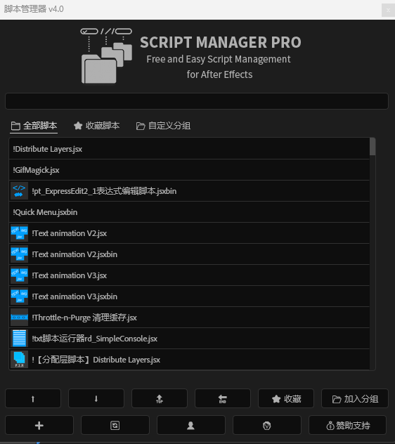
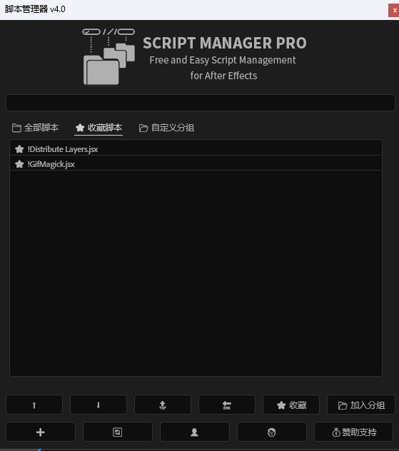

[中文说明](README.zh.md) | [English](English.md
)
# After Effects Script Manager Free

📂 **Script Manager Pro v4.0**  
Author: Master M (M师)  
Official Website: [https://www.materhd.com](https://www.materhd.com)  
License: Free to use, redistribution and resale are prohibited  

---
## 🎨 Preview

  
  
  

> These icons will automatically appear in the script list if PNG files with the same names as your scripts are placed in the same folder.

## ✨ Features

`Script Manager Pro` is a powerful script management tool for Adobe After Effects, providing:

- ✅ **Automatic Script Scanning & Listing**  
  Automatically detects `.jsx` and `.jsxbin` files from the main and additional directories.

- ⭐ **Favorites Management**  
  Mark your most-used scripts with one click for quick access.

- 📂 **Custom Grouping**  
  Add, rename, and delete groups. Sort scripts within groups (move up/down, top/bottom).

- 🔍 **Search Function**  
  Fuzzy search by script names or group keywords.

- 🖼️ **Icon Support**  
  If a `.png` file with the same name exists in the script directory, it's used as the script icon.

- ⚙️ **Persistent Config**  
  Groups and favorites are stored in a local `data.json` config file.

- 👤 **About & Author Info**  
  Built-in panel for version info and contact details.

- 💰 **Donation Options**  
  Optional donation panel with support for Alipay, WeChat, PayPal, cryptocurrency, etc.

---

## 🧩 Installation & Usage

1. Open After Effects.
2. Enable scripting permissions:  
   `Edit > Preferences > General > Allow Scripts to Write Files and Access Network`
3. Copy `ScriptManagerPro.jsx` into AE’s script folder:
   - Windows: `C:\Program Files\Adobe\Adobe After Effects <version>\Support Files\Scripts\`
   - macOS: `/Applications/Adobe After Effects <version>/Scripts/`
4. Launch the script. On first run, select your primary script folder.
5. Use the interface to organize, favorite, and run scripts.

---

## 📁 Directory Structure

aftereffectsscriptmanagerfree/ 
├── ScriptManagerPro.jsx # Main script file 
├── Icons/ # Icons folder (auto-generated) │
├── 1.png # Logo icon 
├── data.json # Config file (auto-generated)

---

## 📜 License

- This script is **completely free** for personal and commercial use.
- **Do not sell, rebrand, or redistribute** the tool in any form.
- All trademarks and copyrights belong to their respective owners.
- If someone charged you for this script, **request a refund immediately** – it’s a scam!

---

## 🙋‍♂️ Author Info

- 👤 Author: Master M  
- 💬 WeChat / QQ: 1193467896  
- 📣 Public Account: 文景探月  
- 📺 YouTube: [@materhd](https://www.youtube.com/@materhd)  
- 🌐 Website: [https://www.materhd.com](https://www.materhd.com)
---

## 💖 Support Development

If you enjoy using this tool, consider supporting the author:

- Alipay / WeChat / PayPal / Crypto donations
- Join the community: Telegram / QQ Group / WeChat Group / Discord

---

> ✏️ This project is free and open for everyone. For custom development or business collaboration, feel free to reach out.
